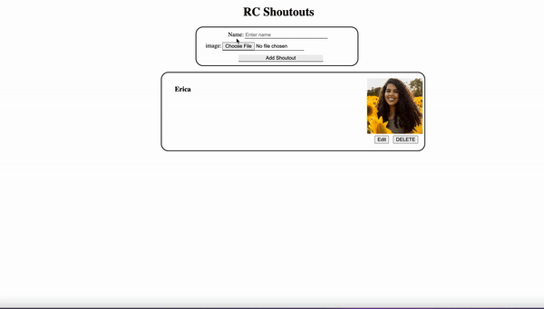

# RC Shoutouts!
An app for that special member of the community who deserves some love!  

**Link to project:** https://github.com/CydVilla/rc-shoutouts

## How It's Made:

**Tech used:** HTML, CSS, JavaScript, Node.js, MongoDB, Express
RC shoutouts is a full-stack application, allowing users to create, retrieve, delete and update their respective shoutouts. 
Image references and usernames are stored on MongoDB, connected via Express.

<!-- ## Optimizations
*(optional)*

You don't have to include this section but interviewers *love* that you can not only deliver a final product that looks great but also functions efficiently. Did you write something then refactor it later and the result was 5x faster than the original implementation? Did you cache your assets? Things that you write in this section are **GREAT** to bring up in interviews and you can use this section as reference when studying for technical interviews! -->

## Lessons Learned:

Images themselves can't be stored as easily as text, they must be hosted.

<!-- ## Examples:
Take a look at these couple examples that I have in my own portfolio:

**Palettable:** https://github.com/alecortega/palettable

**Twitter Battle:** https://github.com/alecortega/twitter-battle

**Patch Panel:** https://github.com/alecortega/patch-panel

 -->
